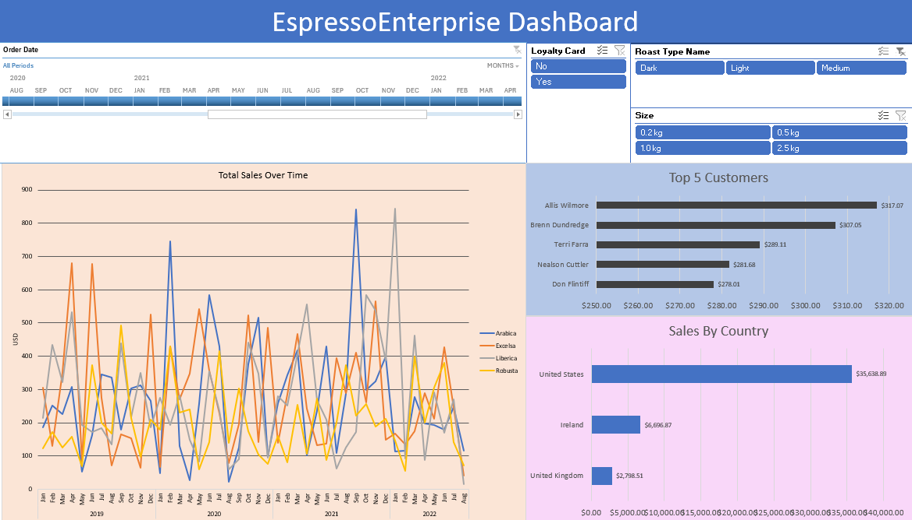

# What is EspressoEnterprise ?

EspressoEnterprise is an analysis of a coffee sales dataset, incorporating order, customer, and product data, utilizing Excel. The project includes the creation of a dynamic dashboard featuring interactive visualizations such as line and bar charts. These visualizations provide insights into total sales trends over time, top customers and their sales figures, and sales breakdowns by country. The dashboard is enhanced with a timeline and slicers, allowing users to dynamically explore and visualize data based on various filters such as time period, customer loyalty status, coffee roast type, and size.

 

# Process
- Utilized XLOOKUP and the primary key in the orders table to establish links and extract data from the customers and products tables.
- Created pivot tables to analyze patterns in the data and employed charts to visually represent pivot table data.
- Conducted data cleaning tasks, including the removal of duplicates, and sorted the data for clarity and consistency.

# Visualizations
- Utilized line and bar charts to visually represent common patterns such as total sales trends over time, top customers and their respective sales figures, and sales breakdowns by countries.

- Implemented timeline and slicers to enhance user interactivity and facilitate deeper insights into the data.

